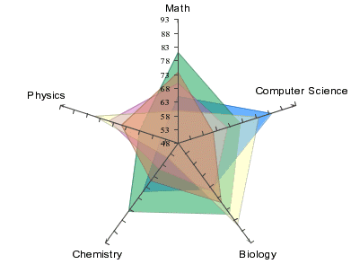
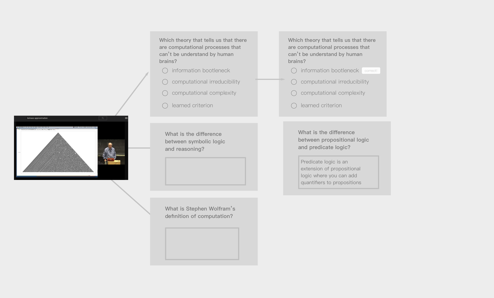
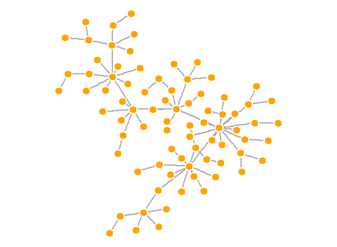
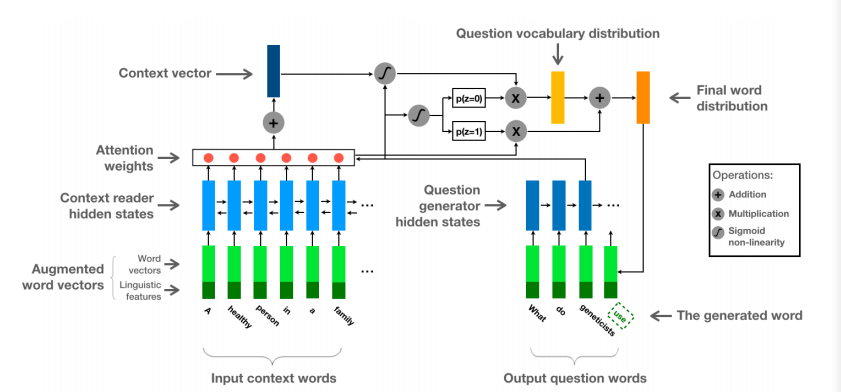
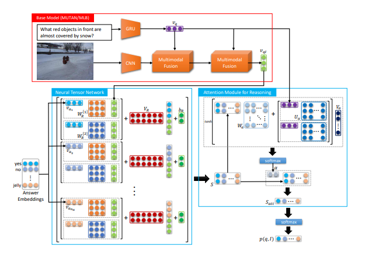
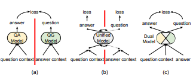
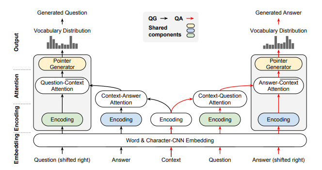

# Introduction 

Let's start with a future view of an individual's education. Many of us have used the internet to educate ourselves with the abundance of high quality videos, papers, articles, podcasts and how-tos all over the web. Let us imagine that all of what you have learned online (throughout the entirety of your life), from the hundreds of Youtube videos, Wikipedia articles, Nature papers, and podcasts you've read, watched, or listened to, were all consolidated into what we might call a **digital education footprint**. 

The **digital education footprint** would string together our online education into a concrete representation of an individual's online education and could be extended into more formal settings. By showcasing the broad range of individual's knowledge (making digital music) as well as the places they've went deeper than most (deep learning or philosophy of mathematics), we could begin to accept education as a life-long journey rather than one monolithic part of an individual's past. This would begin to show us a more accurate depiction of individual's education that could be updated each and everytime one educates themselves. With every new year, their footprint would evolve just as the very thread of their lives would. Visualised over time, we would be able to see an individual's journey or even a whole communities. Seeing how differen

In this essay, I will propose a new way to approach education which will require significant effort to bring to life but I believe the benefits will surely outweigh the costs. I'll talk about how we can use machine learning and deep learning in particular to help create our **digital education footprint**, **student journeys**, and a collective human knowledge graph. This will allow us to take the space of unstructured educational content and begin to map it unto a knowledge graph and use generative models to make educational content engaging and test a student's knowledge no matter the subject. I will name a few benefits of such a future.

- A society where individuals do not simply compete for a degree but where they can feel safe to create their own unique journey through human knowledge and still be recognised and predictable to others
- A society where an individual's knowledge is derived not from what we know about a degree but by their actual knowledge which is alive and therefore always evolving
- A society that better understands itself, through the understanding of the many journey's it's members have taken and the collective knowledge that has gone mostly unaccounted for in today's degree based education.

I will also show that this imagined future is not only **desirable** for society but also that much of it is currently feasible mainly due to the most recent advances in machine learning, and in particular deep learning, which will enable us to begin designing such a future today. 

# Concerns

 There are 3 popular concerns that I will attempt to address in this article about online learning in the present and the future. I will attempt to address them here and in the implementation section below.
 
- The first concern is that the learning is often passive
- The second concern is that the information remains untested and therefore doesn't truly make the leap from information to true knowledge.
- The third concern is that even if the two concerns above were met definitively, it would not be possible to .

## Passive Consumption

It has been argued and shown in some studies[insert studies], that many people who consume videos or other forms of educational content online, especially when outside the context of school, are often consuming the content passively. This leads to what a colleague called "swiss-cheese learning", where one learns a bit here and there, lacking any real rigour or depth providing very little probability of capturing the major concepts or mastering the content in any adequate sense.

This is a concern that is widely observed. Passive watching is not equivelent to learning. There are many variables that are related to this including those that are cultural and biological. 

Here I'll focus on two points. I argue that educational content online expects the content to help a student reach a particular goal. There is nothing in the content itself, or the platforms, that reach out to reinforce or to verify the knowledge one has gained. 

I will argue that some key elements of these features  that these issues are 
Engagement can be increased if x, goal directed behaviour can be enhance by small learning goals.

- Engagement
- Goal-Directed

> People watch videos casually and on the fly—and they rarely turn their phones sideways to do it. - Facebook Ads

## Untested Knowledge

It has been argued that it is hard to verify what someone has learned while consuming educational content online. This is generally true outside of those content producers who combine content and testing (i.e. Khan Academy, Udacity, Coursera) but they are generally limited compared to the vast amount of videos that are available that lack this testing.

The knowledge 

## Predictability

Concerns #1 and #2 can be solved and it could serve the individual who is seeking to master the content of a particular or several subjects. An individual could find themselves engaging with the goal of mastering the subjects, knowing that their grasp of the knowledge would be tested. 

But it does not solve the societal issue. If you are like myself, you have watched more videos and read more articles online than you did when you were in school. Possibly much more. But how does one make sense of such consumption since it is largely unstructured and from various individuals and institutions. Let us take degrees and their success in making an individual's ability predictabe. A degree not only makes an individual predictable, in fact, it makes a whole class of individuals predictable on one crucial dimension. When we know one has a BA in Mathematics we know that they should have some knowledge of mathematics. We can imagine that an individual with such a degree has working knowledge of a familiar set of subjects (even if one doesn't know much about mathematics) and also the type of work they might be able to do. This is because of the traditions of our educational institutions and practices. The predictability is due to our past knowledge of what a particular subject is about and the occupational outcomes of such knowledge. The bad part is that degrees are beginning to tell less and less of the story. So for all of it's ability to reduce the complexity of gained knowledge, it is too limiting to represent a user's true level of knowledge.

So Online educational content consumption does not 

# Universal Teaching Machine

So how would a universal teaching machine eclipse these challenges? We will present a solution that meets all three criteria by introudcing a theoretical artificial network architecture to cover the first two.

neural then cover each concept in detail. Our idea of a digital education footprint,  journeys, and a knowledge graph will provide us with what we need to take a first stab at encompassing a student's whole education by addressing the three concerns.

In order to take all of our videos 

## The components
A component of a universal teaching machine should be able to take any of the billions of educational content online (and eventualyl off) and by using machine learning and deep learning techniques complete the following:
- assign it to a one or more knowledge subjects (i.e. math, design, computer science)
- generate a set of adequate questions and answers that test the student's (what is x? a, b, c, or d) knowledge throughout the learning session

# Concepts 

### Digital Education Footprint
The concept of a digital education footprint is is a custom symbol and profile that represents one's education relative to that of others. Each symbol should be somewhat unique and the profile could capture the general education as well as the intricacies. 

A symbol which represents somethng as complex as one's education will likely not be enough for employeers and co-workers to understand the . A symbol must show that one is in a particular "class" while also  Symbols generally have to make trade-offs

### Journeys

 between the complexity of what it represents and it's ability to convey , the legi from dealing with the task of reduction of info. So we introduce **Journeys** which show how someone has traversed the uy
If most people had their digital education footprint, they would be 

### Human Knowledge Graph
We have so far introduced **digital education footprint** and **journeys**, which claim to be the right elements to synthesis one's education. But how does one create a path? From video to video? From topic to topic? If so, how might a machine decide on the topic? We have had plenty of advances in topic models but perhaps what we actually need is a graph of human knowledge. This graph, like Google's knowledge graph, should be generated both from the current structure of education and also driven by unsupervised learning of new topics that don't exist on today's knowledge graph.

This graph would be useful so content on the web could be easily mapped to the graph adn relate one user to another as well as create trails.

## From Data to Wisdom (DIKW)

 
Over time, it is plausible, that our digital education footprint would be the most important representation of an individuals level of education. Even more important than our primary education; it has done much to make us predictable, but it has sacrificed the true range of an individual's gained knowledge and wisdom coming from any other place than the institution is willing to give credit for. 

Since we've largely rely upon large institutions to educate groups of individuals, many have grown deeply familiar with having a perfectly demarcated path towards a degree, so it has been much harder for individuals to use this abundance of knowledge to chart their own educational journey in today's fast moving world.

 being   us how to the peer pressure of cohorts, self-learning  learned Imagine that if you signed up for a job, your primary consideration and also your digital education could be conveyed as a path through the web that others attempt to follow or mix and match. Now let us imagine a world where our digital education fingerprint allowed us to

## Part I - Rethinking education
 
  E2QA - a theoretical neural network architecture to generate questions and answers from video.
  
  
## Part III - Supporting theories for deep learning

Theory of the learnable
Mutual Information
Joint probability

## Part IV - Survey of empirical results

---
title: "CMT"
author: "hw"
date: "November 9, 2018"
output: html_document
---

In order to create a adequate system that can take on this mission and vision that we shared above, we certainly need to leverage the state-of-art algorithms and even more advanced ones that will be developed soon. Let's first take a look at some methods that might come handy when tackling our problem.

Note that here we will mainly focus on how to possibly set our foot into this problem by exploring muliple existing deep learning algorithms in the related domains.

## Problem Foumlation

Let's begin our investigate by breaking down our goal into few sub-goals and we will then take a close look at each of them.

First, we need to have a hybrid system that can process any learning media (i.e. a video, a e-book or an audio recording clip) and automatically generated a set of questions (both close ended like multi-choice question or open-ended like writing a quick summary) for the learners.

If the questions generated are close-ended, the model should also be able to generate the right answer based on the context provided and evaluate the results answered by the learners. 

If the questions generated are open-ended, the model should be able to evaluate the result as well and provide a approximate score as the feedback. 

This is our first set of problems - **LEARNING by ANSWERING**. 

Next, we need to consider how we can provide an adequate and relevant learning map for the learners based on their progress and the knowledge graph/map given that we have a ever growing amount of educational content on the web. 

This is our second set of problems - **KNOWLEDGE ARCHITECT**.

What's more, the knowledge graph might be universal, but everyone's learning journey is still highly personal and custom. In terms of learning, everyone seems to have their unique set of problems to solve or they are curious about and everyone is on their unique mission towards mastery.

We cannot create an online learning/teaching system without taking this crucial factor into account. In order to put our hands on this set of issues, we can rely on some heuristic and models that have been developed to solve this idiosymcratic issue.

This is our thrid set of problems - **MISSION MAPPING**.

## Why deep learning? 

Just as any other problems that can be solved with deep learning, our problem could be simplied as a function that maps the input to the output. Deep learning is known as one of the most flexible machine learning algorithms that can learn and map the **deep representation** from the data and in turn contribute to our unique set of problems i.e. automatic question and answer gnerating or visual question answering problems. Moreover, by leveraging neural network architecture, deep nueral networks architecture can be composed into a single differentiable function and trained end-to-end and they can help identify the suitable *inductive* *biases* catered to the input data type. 

# LEARNING by ANSWERING
## Question Generation

The goal of an automatic question generation is to generate a question Q that is syntactically and semantically correct, relevant to the context and meaningful to answer. 

In order to achieve this goal,, we need to train an algorithm to learn the underlying conditional probability distribution $P_{\theta}(Q|X)$ parametrized by $\theta$. Or in other words, we can think of this problem is the one to learn a model $\theta$ during training using text-question pairs so that the probability $P_{\theta}(Q|P)$ is maximized over the given training dataset. 

** Case Studies** 
1. We can think  of it as a seq2seq learning problem; In this paper [QG-Net: A Data-Driven Question Generation Model for Educational Content](http://www.princeton.edu/~shitingl/papers/18l@s-qgen.pdf). They use a bi-directional LSTM network to process the input context words sequence. Encoding the answer into context word vectors.

QG-Net generates questions by iteratively sampling question words from the conditional probability distribution $P(Q|C,A,\theta)$ where $\theta$ denotes the set of parameters. In order to construct the probability distribution, they first create a **context reader** that process each word $c_j$ in the input context and turns it into a fix-sized representation $h_j$

Then, they used a **question generator** generates the question text word-by-word, given all context word representation and all question words in previous time steps. 

As for the quantitative evaluation, they aimed to minimize the difference between the generated question and the true question in the training set during training. Also, they used the standard back-propagation through time with the mini-batch stochastic gradient descent algorithm to learn the model parameters. They employed teacher forcing procedure for training LSTMs. To enhance performance, they also implemented beam search, a greedy but effective approximation to exhausitively search and select the top 25 cancidate output question sentences. The final one would be the one with the lowest negative log likelihood. 

The general QG-Net model Architecture is as below: 

2. In this summary [Learning to Ask](http://www.cs.cornell.edu/~xdu/papers/acl17_dsc_poster.pdf), they used a sentence- and paragraph-level seq2seq model to read text from the input content and generate a question about the input sentence. 

For the second option, we need to encode both sentence and paragraph that sentence belongs to as input, but only attending source sentence hidden states. The performance could be improved with beam search and UNK replacement. 

3. In this paper [TOPIC-BASED QUESTION GENERATION](https://openreview.net/pdf?id=rk3pnae0b), they proposed a topic-based question generation algorithm. The algorithm will be able to take in a input sentence, a topic and a question type; then generate a word sequence related to the topic, question type and the input sentence. 

  They are formulating a conditional likelihood objective function to achieve this goal. 

  Also, in the paper, they proposed a few frameworks that were used to tackle this problem. The first type   is seq2seq model. This model typically uses a bidirectional LSTM as the encoder to encode a sentence and a   LSTM as the decoder to generate the target question. 
  The second approach is question pattern prediction and question topic selection algorithms. It takes in an   automatically selected phrase Q and fill this phrase into the pattern that was predicted from pre-mined   patterns, which is not done with deep learning. 

  The last approach is multi-source seq2seq learning which aims to integrate information from multiple sources to boost learning. 

4. In this paper [A Framework for Automatic Question Generation from Text
using Deep Reinforcement Learning](https://arxiv.org/pdf/1808.04961.pdf) they proposed a novel way of solving this problem in which they used a reinforcement learning framework that consists of a generator and an evaluator. 

They refer to the generator as the $agent$ and the $action$ of the agent is to generate the next work in the question. The probability of decoding a word $P_{\theta}(word)$ gives a stochastic policy. 

The evaluator will in turn assign a reward for the output sequence predicted using the current policy of the generator. Based on the reward assigned by the evaluator, the generator updates and improves its current policy. The goal in RL-based question generation is to find a policy that can maximize the sum of the expected return at the end of the sequence generated. 

## Answer Evaluation 
### Close-ended Questions
**Visual Question Answering (VQA)**

As what we have discussed above, most question focuses solely on generating proper questions but not the answers. 

VQA aims to enable the machine to answer the question automatically which could in turn automated the whole question generating and evaluation process. 

Started from the question-guided attention mechanism that can adaptively learn the most relevant image regions for a given question. Then to stack multiple question-guided attention mechanisms to learn the attention in an iterative way. Also, it is possible to use bilinear features to integrate the visual features from the image spatial grids with question features to predict attention.

Considering the questions in natural language may also contain some noise, the co-attention mechanism can jointly learn the attention for both the image and question.

1. In this paper [Deep Attention Neural Tensor Network for
Visual Question Answering](http://openaccess.thecvf.com/content_ECCV_2018/papers/Yalong_Bai_Deep_Attention_Neural_ECCV_2018_paper.pdf),

2. In this paper [Question Type Guided Attention in Visual Question
Answering](https://arxiv.org/pdf/1804.02088.pdf), they proposed a model called Question Type-guided Attention (QTA). This model utilizes the information of question type to dynamically balance visual features from both top-down and bottom-up orders. Meanwhile, it has a novel neural architecture that dynamically gates the conribution of ResNet and Faster R-CNN features based on the question type.

#### Dual Question-Answering Model

Both Question Generaion(QG) and Question Answering(QA) are well-defined 2 sets of models that aim to either infer a question or an answer given the counterpart based on the context. However, our goal is to have a complete automated system that can take on both roles simultaneously for us.  

There are some algorithms are designed to fulfill both roles. In this paper [Dual Ask-Answer Network for Machine Reading Comprehension](https://arxiv.org/pdf/1809.01997.pdf) they presented a model that can learn question answering and question generation simultaneousely. 

The idea is illustrate as below: 

### Open-ended Question
As for the automated feedback or learning grading system, there are plenty of suggestions have been proposed as well to tackle such a question. The framework is called automated essay scoring (AES) which focuses on automatically analyzing the quality of writing and assigning a score to the text. 

In terms of knowledge or learning evaluation, the format could be diversed i.e. a lecture given by the student or an short summary essay written by the student. Regardless the form, we can always convert the content into a predictable text, graphic or audible format that model can process. 

As we mentioned above, for these type of task, we can implementing RNN to process the content and even enhance the model performance by adversarially craft input as this paper [Neural Automated Essay Scoring and Coherence Modeling for
Adversarially Crafted Input](http://aclweb.org/anthology/N18-1024) illustrated.

# KNOWLEDGE ARCHITECT

As I mentioned earlier, learning is a knowledge accumulation process. Knowledge itself has its unique structure that can help us learn in a most effective and productive way. Knowledge Graph is a great tool that we developed to map and present the structure of knolwedge. In shirt, knowledge graphs are collections of relational facts, where each fact states that a certrain relation holds between 2 entities.

In this paper [Generalized Embedding Model for Knowledge Graph Mining](http://www.mlgworkshop.org/2018/papers/MLG2018_paper_5.pdf), they have presented a model for learning neural presentation of generalized knowledge graphs using a novel muli-shot unsupervised neural network model, called the **Graph Embedding Network (GEN)**. This model is able to learn different types of knowlege graphs from a universal perspective and it provides flexibility in learning representations that work on graphs conforming to different domains. 

In this paper [Probabilisic Knowledge Graph Embeddings](https://openreview.net/pdf?id=rJ4qXnCqFX), they explored a new type of embedding model that can link prediction in relational knowledge graph. 

# MISSION MAPPING 

The key to create an education or a learning/teaching system is to be able to present a high quality study material and provide a high quality feedback on student's learning. 

Let's begin with the first issue, we can easily identify the association of our problem with a problem that has been solved with recommender system. 

As we all know that a recommender system is an intuitive line of defense against consumer over-choice given the evern growing information available on the web. As we mentioned earlier in the knowledge graph, a authoritative and personalized recommending system is essential for facilitating the learning. 

Typically, a recommendation models can be classified into 3 main categories: 

1. Collaborative filtering

2. Content based 

3. Hybrid recommender system 

As I mentioned, here we will mainly focus on hybrid recommender system. 

There are a diverse array of achitectual paradigms that are closely related recommending system. Let's take a look at few of them: 
1. Autoencoder 

2. Convolutional Neural Network 

3. Recurrent Neural Network 

4. Restricted Boltzmann Machine (RBM)

5. Adversarial Networks

6. Attentional Models (AM)

7. Deep Reinforcement Learning (DRL)

**Reference** 

1. [A Framework for Automatic Question Generation from Text using Deep Reinforcement Learning](https://arxiv.org/pdf/1808.04961.pdf)

2. [Learning to Ask: Neural Question Generation for Reading Comprehension](https://arxiv.org/pdf/1705.00106.pdf)

3. [Deep Attention Neural Tensor Network for Visual Question Answering](http://openaccess.thecvf.com/content_ECCV_2018/papers/Yalong_Bai_Deep_Attention_Neural_ECCV_2018_paper.pdf)

4. [Learning to Ask](http://www.cs.cornell.edu/~xdu/papers/acl17_dsc_poster.pdf)

5. [TOPIC-BASED QUESTION GENERATION](https://openreview.net/pdf?id=rk3pnae0b)

5. [Deep Learning based Recommender System](https://arxiv.org/pdf/1707.07435.pdf)

## Part V - Call to action

# Conclusion

# References

---
references:
- id: meier2012
  title: Professinal Android 4 Application Development
  author: 
  - family: Meier
    given: Reto
  type: book
  publisher: John Wiley & Sons, Inc.
  issued:
    year: 2012
    month: 5
- id: fenner2012a
  title: One-click science marketing
  author:
  - family: Fenner
    given: Martin
  container-title: Nature Materials
  volume: 11
  URL: 'https://doi.org/10.1038/nmat3283'
  DOI: 10.1038/nmat3283
  issue: 4
  publisher: Nature Publishing Group
  page: 261-263
  type: article-journal
  issued:
    year: 2012
    month: 3
...

